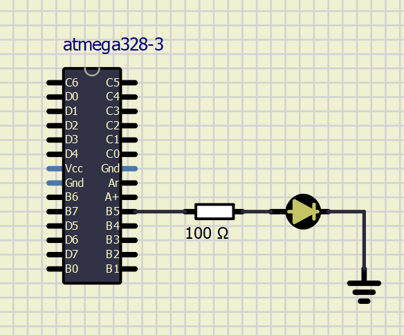

## Lab 1: Tools, Github and Atmel
Manual to programming in Atmel 7.0-> [Atmel](https://unboxing-tomorrow.com/programming-atmel-microcontrollers-with-atmel-studio-7/)

Manual to SimullDE-> [SimullDE](https://www.simulide.com/p/blog-page.html)

