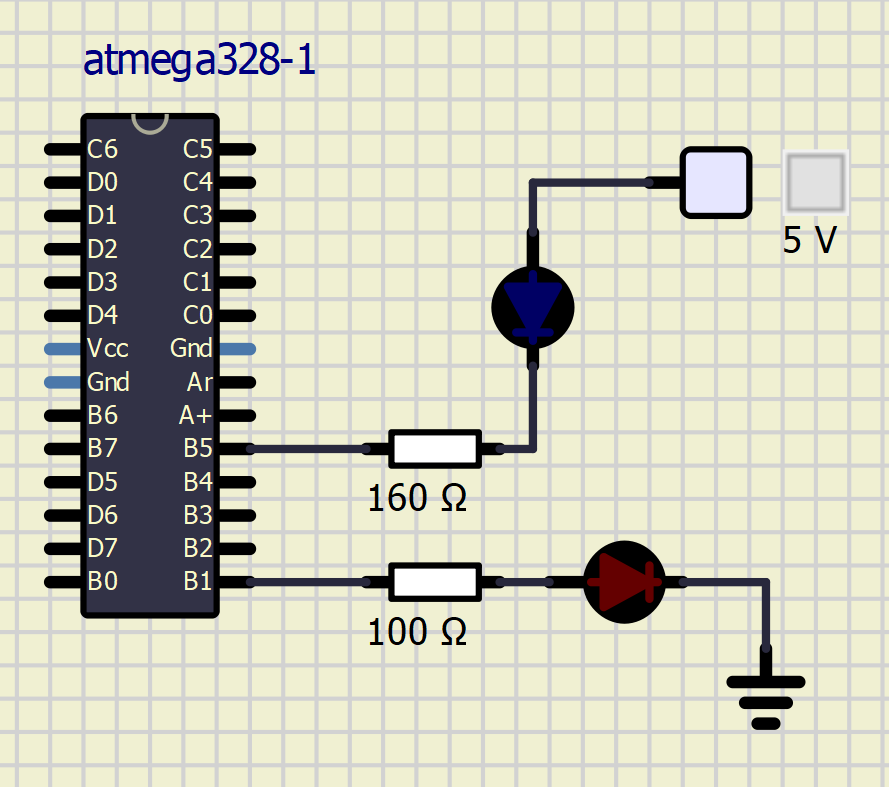
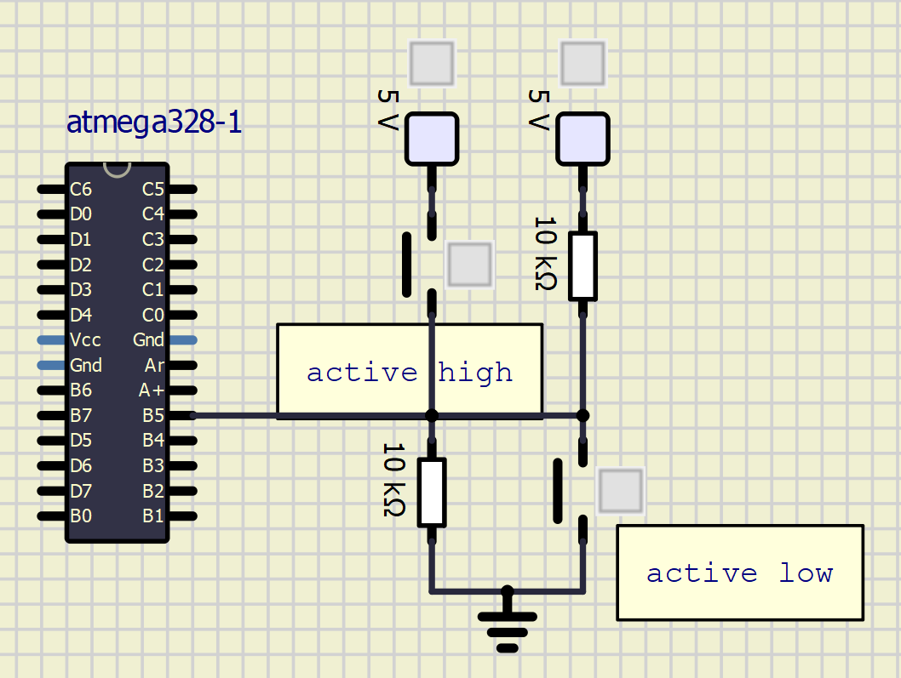

## Lab 2: Control of GPIO, LED, push button
[Datasheet Arduino](https://github.com/tomas-fryza/Digital-electronics-2/blob/master/Docs/arduino_shield.pdf)

###Before the Laboratory

Attiny328P:LED pins PORTB.5-2 ? 
           Buttons  PORTC.1-3 ?

| :---:        |     :---:      |         :---: |        :---: |      :---: |
| LED color   | Supply voltage    | LED current   | LED voltage   | Resistor value  |
| red    | 5 V      | 20 mA      |1,8 V      |160 Ω      |
| blue    | 5 V      | 20 mA      |3 V      |100 Ω |

###Laboratory
