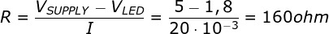

## Lab 2: Control of GPIO, LED, push button
[Datasheet Arduino](https://github.com/tomas-fryza/Digital-electronics-2/blob/master/Docs/arduino_shield.pdf)

Special function registers
| **Function** | **Example** | **Description** |
| :-- | :-- | :-- |
| `bit_is_set(reg_name, pin_num)` | `if (bit_is_set(PINA, 3)) {...}` | Perform the code only if bit number 3 in register PINA is 1 (set) |
| `bit_is_clear(reg_name, pin_num)` | `if (bit_is_clear(PINB, 5)) {...}` | Perform the code only if bit number 5 in register PINB is 0 (clear) |
| `loop_until_bit_is_set(reg_name, pin_num)` | `loop_until_bit_is_set(PIND, 0);` | Stay here until bit number 0 in register PIND becomes 1 |
| `loop_until_bit_is_clear(reg_name, pin_num)` | `loop_until_bit_is_clear(PINA, 7);` | Stay here until bit number 7 in register PINA becomes 0 |

### Before the Laboratory

Attiny328P:
LED pins PORTB.5-2 and they are connected as active-low.

Buttons  PORTC.1-3 and they are connected as active-low too.

|**LED color**|**Supply voltage**|**LED current**|**LED voltage**|**Resistor value**|
|:-:|:-:|:-:|:-:|:-:|
|red|5&nbsp;V|20&nbsp;mA|1,8&nbsp;V|160&nbsp;Ω|
|blue|5&nbsp;V|20&nbsp;mA|3&nbsp;V|100&nbsp;Ω|

### Laboratory
|**DDRB**|**Description**|
|:-:|:-:|
|0|Input pin|
|1|Output pin|

|**PORTB**|**Description**|
|:-:|:-:|
|0|Output low value|
|1|Output high value|

|**DDRB**|**PORTB**|**Direction**|**Internal pull-up resistor**|**Description**|
|:-:|:-:|:-:|:-:|:-:|
|0|0|Input|No|Tri-state,High impedance|
|0|1|Input|Yes|PB will source current if ext. pulled low. (MCUCR(PUD)=0)|
|1|0|Output|No|Output low value|
|1|1|Output|No|Output high value|

|**Port**|**Pin**|**I/O?**|
|:-:|:-:|:-:|
|A|x|Atmega328P doesnt have port A|
|B|0|Yes(Arduino pin 8)|
||1|No(Arduino pin 9)|
||2|No(Arduino pin 10)|
||3|No(Arduino pin 11)|
||4|Yes(Arduino pin 12)|
||5|Yes(Arduino pin 13)|
||6|In Arduino Uno No(Ext. XTAL1)|
||7|In Arduino Uno No(Ext. XTAL2)|
|C|0|Yes(Arduino pin A0)|
||1|Yes(Arduino pin A1|
||2|Yes(Arduino pin A2|
||3|Yes(Arduino pin A3|
||4|Yes(Arduino pin A4/SDA|
||5|Yes(Arduino pin A5/SCL|
||6|No(RESET button)|
||7|Doesn have Pin 7|
|D|0|Yes(Arduino pin Rx<-0)|
||1|Yes(Arduino pin Tx->1)|
||2|Yes(Arduino pin 2|
||3|No(Arduino pin 3|
||4|Yes(Arduino pin 4|
||5|No(Arduino pin 5|
||6|No(Arduino pin 6|
||7|Yes(Arduino pin 7|

### Knight rider style

### PWM generator

