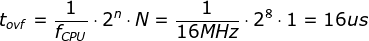
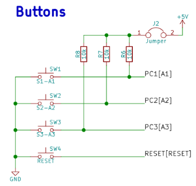
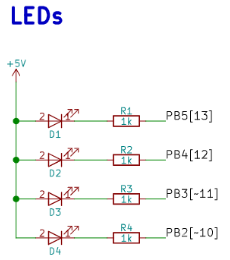
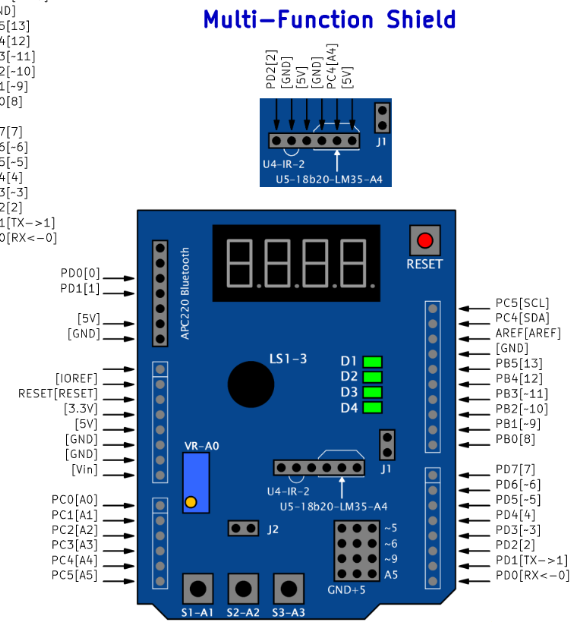

# Lab 4: Interrupts, timers

## Preparation

| **Module** | **Number of bits** | **1** | **8** | **32** | **64** | **128** | **256** | **1024** |
| :-: | :-: | :-: | :-: | :-: | :-: | :-: | :-: | :-: |
| Timer/Counter0 | 8  | 16u | 128u | -- | 1024u | -- | 4096u | 16384u |
| Timer/Counter1 | 16 | 4096u | 32768u | -- | 262144u | -- | 1048576u | 4194304u |
| Timer/Counter2 | 8  | 16u | 128u | 512u | 1024u | 2048u | 4096u | 16384u |

## Laboratory