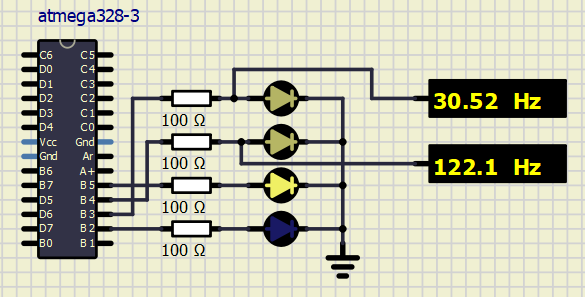
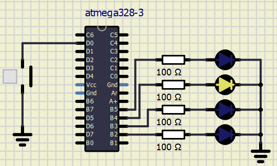
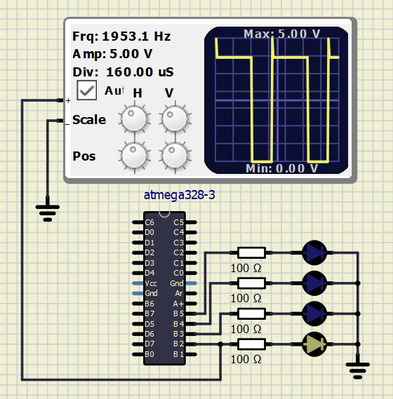

# Lab 4: Interrupts, timers

## Preparation

| **Module** | **Number of bits** | **1** | **8** | **32** | **64** | **128** | **256** | **1024** |
| :-: | :-: | :-: | :-: | :-: | :-: | :-: | :-: | :-: |
| Timer/Counter0 | 8  | 16u | 128u | -- | 1024u | -- | 4096u | 16384u |
| Timer/Counter1 | 16 | 4096u | 32768u | -- | 262144u | -- | 1048576u | 4194304u |
| Timer/Counter2 | 8  | 16u | 128u | 512u | 1024u | 2048u | 4096u | 16384u |

## Laboratory

Three timers at ATmega, two are 8-bit and the third is 16-bit. 
Configuration timers using special registers:

| **Module** | **Operation** | **I/O register(s)** | **Bit(s)** |
| :-: | :-- | :-: | :-- |
| Timer/Counter0 | Prescaler  8-bit data value Overflow interrupt enable | TCCR0B  TCNT0 TIMSK0 | CS02, CS01, CS00 (000: stopped, 001: 1, 010: 8, 011: 64, 100: 256, 101: 1024) TCNT0[7:0] TOIE0 (1: enable, 0: disable) |
| Timer/Counter1 | Prescaler  16-bit data value Overflow interrupt enable | TCCR1B  TCNT1H, TCNT1L TIMSK1 | CS12, CS11, CS10 (000: stopped, 001: 1, 010: 8, 011: 64, 100: 256, 101: 1024) TCNT1[15:0] TOIE1 (1: enable, 0: disable) |
| Timer/Counter2 | Prescaler  8-bit data value Overflow interrupt enable | TCCR2B  TCNT2 TIMSK2 | CS22, CS21, CS20 (000: stopped, 001: 1, 010: 8, 011: 32, 100: 64, 101: 128, 110: 256, 111: 1024) TCNT2[7:0] TOIE2 (1: enable, 0: disable) |

Interrupt sources with vectors from C library: [Vectors](https://www.nongnu.org/avr-libc/user-manual/group__avr__interrupts.html)

| **Program address** | **Source** | **Vector name** | **Description** |
| :-: | :-- | :-- | :-- |
| 0x0000 | RESET | -- | Reset of the system |
| 0x0001 | INT0  | `INT0_vect` | External interrupt request number 0 |
| 0x0002 | INT1 | `INT1_vect` | External interrupt request number 1 | 
| 0x0006 | PCINT0 | `PCINT0_vect` | Pin Change interrupt request number 0 |
| 0x0008 | PCINT1 | `PCINT1_vect` | Pin Change interrupt request number 1 |
| 0x000A | PCINT2 | `PCINT2_vect` | Pin Change interrupt request number 2 |
| 0x000C | WDT | `WDT_vect` | Watchdog Time-out interrupt |
| 0x0012 | TIMER2_OVF | `TIMER2_OVF_vect` | Overflow of Timer/Counter2 value |
| 0x0018 | TIMER1_COMPB | `TIMER1_COMPB_vect` | Compare match between Timer/Counter1 value and channel B compare value |
| 0x001A | TIMER1_OVF | `TIMER1_OVF_vect` | Overflow of Timer/Counter1 value |
| 0x0020 | TIMER0_OVF | `TIMER0_OVF_vect` | Overflow of Timer/Counter0 value |
| 0x0024 | USART_RX | `USART_RX_vect` | USART Communication Rx complete |
| 0x002A | ADC | `ADC_vect` | ADC Conversion complete |
| 0x0030 | TWI | `TWI_vect` | 2-wire Serial Interface |

Pins for generate the PWM signal:

| **Module** | **Description** | **MCU pin** | **Arduino pin** |
| :-: | :-: | :-: | :-: |
| Timer/Counter0 | OC0A | PD6 | 6 |
|                | OC0B | PD5 | 5 |
| Timer/Counter1 | OC1A | PB1 | 9  |
|                | OC1B | PB2 | 10 |
| Timer/Counter2 | OC2A | PB3 | 11 |
|                | OC2B | PD3 | 3  |

## PWM generator Timer/Counter1 on channel B -> PB2

Configuration:
Fast PWM with non-inverting mode 
10-bit 
Prescaler: 8 
Duty cycle: 50% 
Enable Interrupt

| **TCCR1A(COM1B1)** | **TCCR1A(COM1B0)** | **TCCR1A(WGM10)** | **TCCR1A(WGM11)** | **TCCR1B(WGM12)** | **TCCR1B(WGM13)** 
| :-: | :-: | :-: | :-: | :-: | :-: |
| 1 | 0 | 1 | 1 | 1 | 0 |
| **TCCR1B(CS12)** | **TCCR1B(CS11)** | **TCCR1B(CS10)** | **OCR1B** |  **TIMSK1(OCIE1B)** |
| 0 | 1 | 0 | 0x01FF | 1 |

