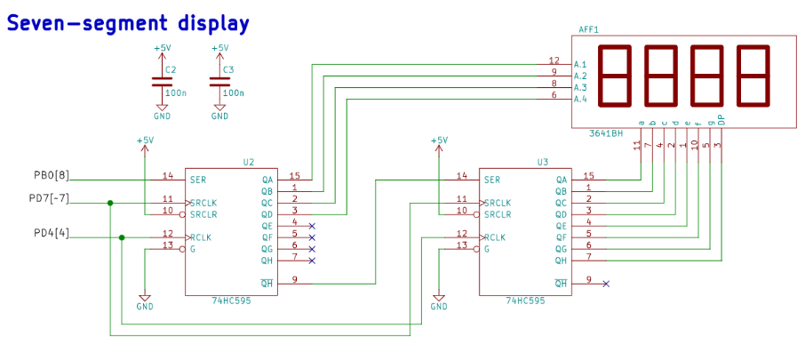
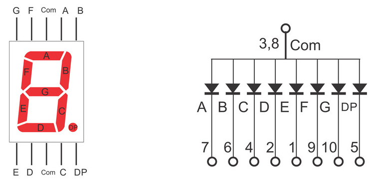
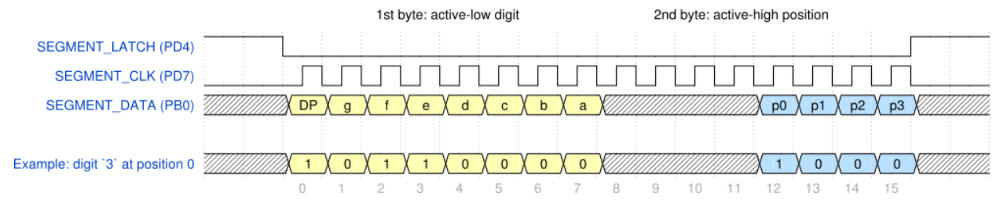
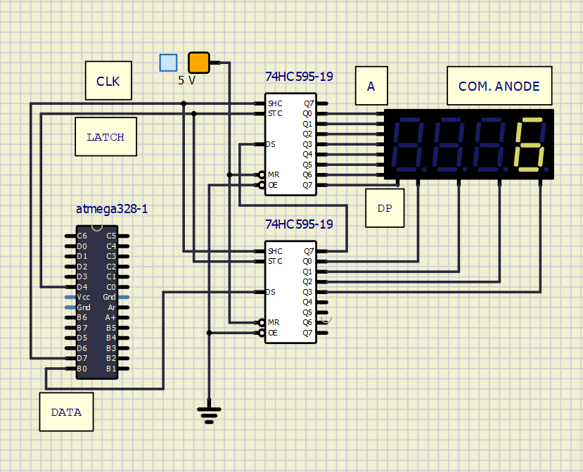
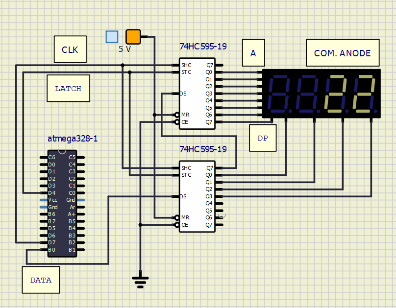
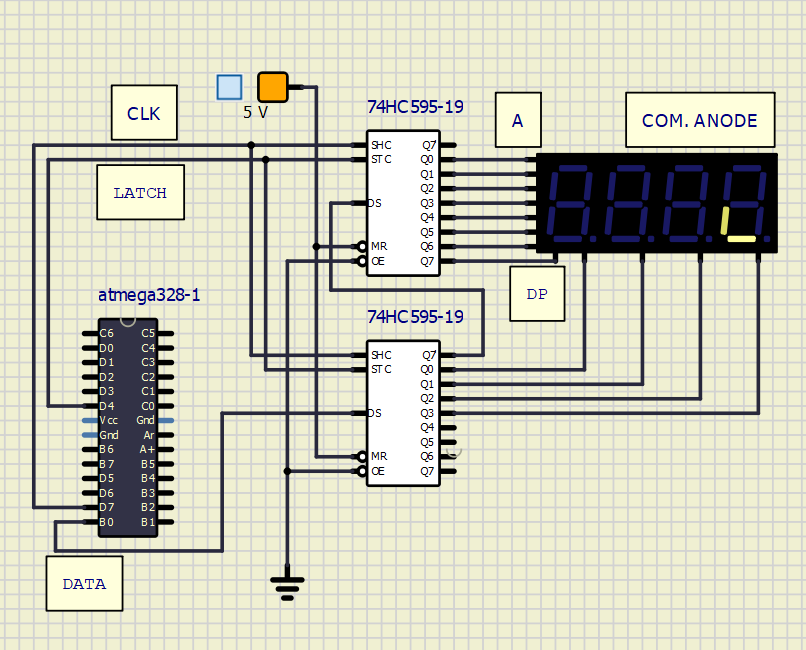

# Lab 5: Display devices, 7-segment

## Preparation

[7-segment display tutorial](https://www.electronics-tutorials.ws/blog/7-segment-display-tutorial.html)




Common Cathode 7-segment display (CC SSD)-toto označení znamená, že ze všech segmentů displeje jsou spojené nožičky ty, které se připojují na zem a druhé kontakty(Anody) spínáme mikroprocesorem.

Common Anode 7-segment display (CA SSD)-segmenty mají společnou nožičku, která se připojí na napájení +5V a druhé nožičky(Katody) spínáme.

### CA SSD:

| **Digit** | **A** | **B** | **C** | **D** | **E** | **F** | **G** | **DP** |
| :-: | :-: | :-: | :-: | :-: | :-: | :-: | :-: | :-: |
| 0 | 0 | 0 | 0 | 0 | 0 | 0 | 1 | 1 |
| 1 | 1 | 0 | 0 | 1 | 1 | 1 | 1 | 1 |
| 2 | 0 | 0 | 1 | 0 | 0 | 1 | 0 | 1 |
| 3 | 0 | 0 | 0 | 0 | 1 | 1 | 0 | 1 |
| 4 | 1 | 0 | 0 | 1 | 1 | 0 | 0 | 1 |
| 5 | 0 | 1 | 0 | 0 | 1 | 0 | 0 | 1 |
| 6 | 0 | 1 | 0 | 0 | 0 | 0 | 0 | 1 |
| 7 | 0 | 0 | 0 | 1 | 1 | 1 | 1 | 1 |
| 8 | 0 | 0 | 0 | 0 | 0 | 0 | 0 | 1 |
| 9 | 0 | 0 | 0 | 0 | 1 | 0 | 0 | 1 |

Dva registry 74HC595 používáme pro dekódování našeho poslaného řetězce po sběrnici, jeden registr ovládá jednotlivé pozice na 4-místném displeji a druhý spíná světelné segmenty na dané pozici.

Ukázka řízení pro číslici ```3``` úplně vpravo:

```javascript
{signal: [
  {name: 'SEGMENT_LATCH (PD4)',
   wave: '1.l...............h.'},
  {name: 'SEGMENT_CLK (PD7)',
   wave: 'l.nn..............l.'},
  {name: 'SEGMENT_DATA (PB0)',
   wave: 'xx33333333xxxx5555xx',
   data: ['DP','g','f','e','d','c','b','a','p0','p1','p2','p3']},
  {},
  {name: 'Example: digit `3` at position 0',
   wave: 'xx33333333xxxx5555xx',
   data: ['1','0','1','1','0','0','0','0','1','0','0','0']},
],
  head: {
    text: '   1st byte: active-low digit                                    2nd byte: active-high position',
  },
  foot: {
    text: '',
    tock: -2
  },
}
```



## Laboratory





### Snake

