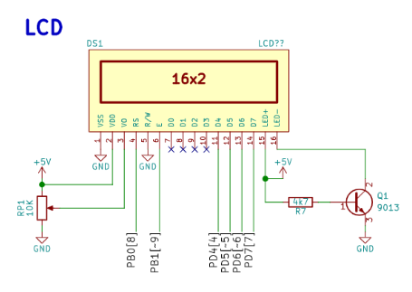
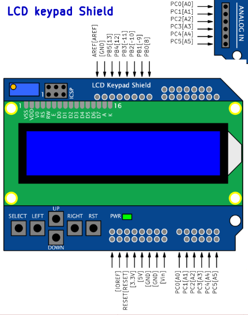
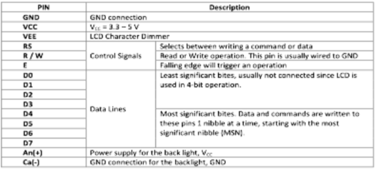
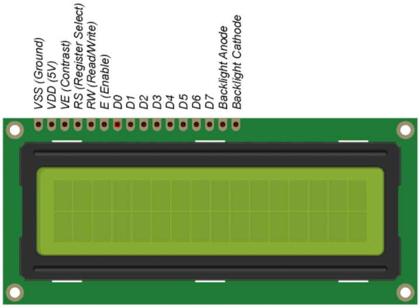
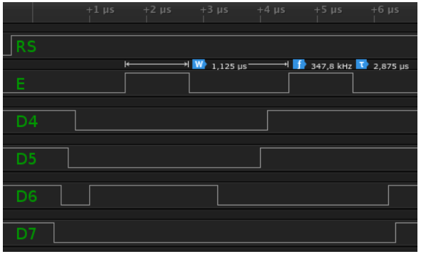
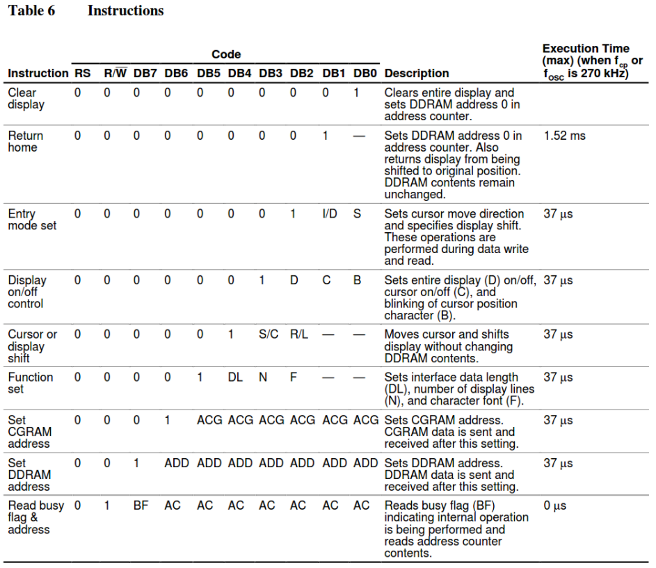
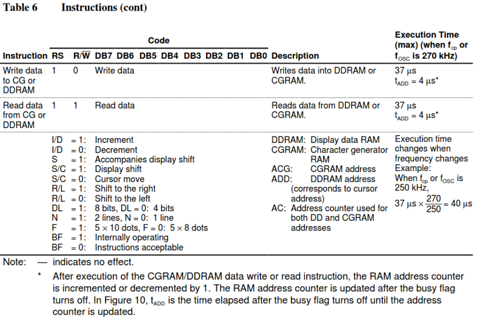
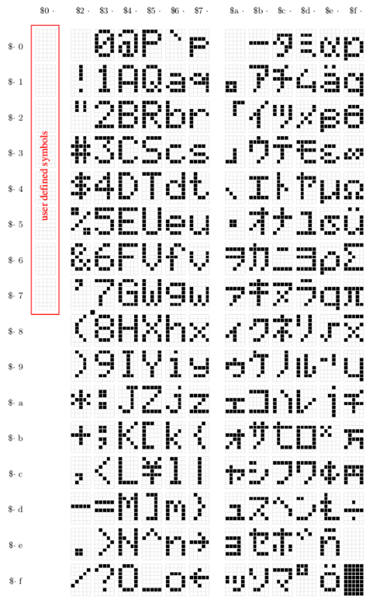
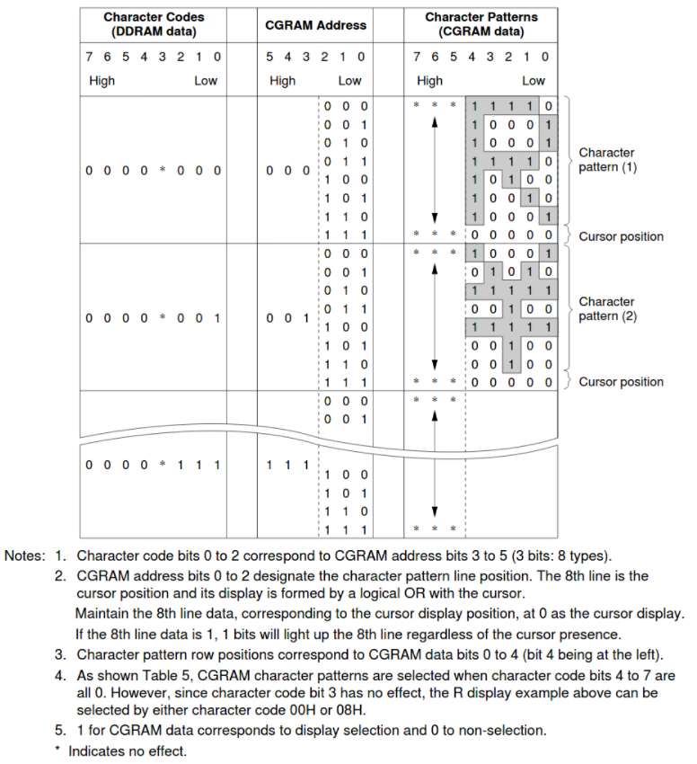
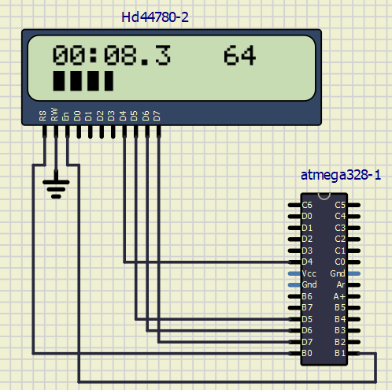

# Lab 6: LCD Display

Control signals used to control LCD.

    | **LCD signal(s)** | **AVR pin(s)** | **Description** |
    | :-: | :-: | :-- |
    | RS | PB0 | Register selection signal. Selection between *Instruction register* (0) and *Data register* (1) |
    | R/W | +5&nbsp;V&nbsp;or&nbsp;GND | Difference between Read and Write, to Read data we must connect to VCC, Write we connect to GND |
    | E | PB1 | Falling edge on this signal say, so the data enabled. |
    | D[3:0] | No connect | We use 4-bit comunication, no 8-bit. |
    | D[7:4] | PD7-PD4 | Our comunication with LCD |

ASCII tabulka je tabulka všech znaků, kde každý znak je reprezentován jako číslo. Číslice 0 až 9 je v rozmezí 48-57, velká písmena 65-90 a malá písmena 97-122.

## Laboratory

LCD (Liquid Crystal Display) se používá k zobrazování jakéhokoli textu pomocí ASCII. Každý znak textu je tvořen 5x8 pixely a existuje mnoho velikostí a typů displeje. Nejčastější je typ COB s čipem na zadní straně (náš HD44780). Největší výrobce je Hitachi.

> Na první sestupné hraně jsou čteny následující signály: `RS = 1` (datový registr) a vysoké čtyři datové bity `D7: 4 = 0100`. Na druhé sestupné hraně jsou dolní čtyři datové bity `D7: 4 = 0011`. Celý bajt přenášený na LCD je tedy `0100_0011 (0x43)` a podle tabulky ASCII představuje písmeno `C`.
> 

[Datasheet LCD](https://www.sparkfun.com/datasheets/LCD/HD44780.pdf)

Pár instrukcí HD44780:

[Library of LCD](http://www.peterfleury.epizy.com/doxygen/avr-gcc-libraries/group__pfleury__lcd.html)

| **Function name** | **Function parameters** | **Description** | **Example** |
   | :-- | :-- | :-- | :-- |
   | `lcd_init` | `LCD_DISP_OFF` `LCD_DISP_ON` `LCD_DISP_ON_CURSOR` `LCD_DISP_ON_CURSOR_BLINK` | Display off Display on Kurzor on Blikající kurzor on&nbsp;&nbsp;&nbsp;&nbsp;&nbsp;&nbsp;&nbsp;&nbsp;&nbsp;&nbsp;&nbsp;&nbsp;&nbsp;&nbsp;&nbsp;&nbsp;&nbsp;&nbsp;&nbsp;&nbsp;&nbsp;&nbsp;&nbsp;&nbsp;&nbsp;&nbsp;&nbsp;&nbsp;&nbsp;&nbsp;&nbsp;&nbsp;&nbsp;&nbsp;&nbsp;&nbsp;&nbsp;&nbsp;&nbsp;&nbsp;&nbsp;&nbsp;&nbsp;&nbsp;&nbsp; &nbsp; &nbsp; &nbsp; | `lcd_init(LCD_DISP_OFF);` `lcd_init(LCD_DISP_ON);` `lcd_init(LCD_DISP_ON_CURSOR);` `lcd_init(LCD_DISP_ON_CURSOR_BLINK);` |
   | `lcd_clrscr` | void | Clear display and set cursor to home. | `lcd_clrscr();` |
   | `lcd_gotoxy` | uint8_t x- horizontal, uint8_t y-vertical | Pozice psaní znaku na displeji | lcd_gotoxy(1,10); |
   | `lcd_putc` | char c | Napsání znaku na display | lcd_putc(a); |
   | `lcd_puts` | const char* s | Napsání celého stringu na display | lcd_puts(auto); |
   | `lcd_command` | cmd | Poslání příkazu | lcd_command(cmd); |
   | `lcd_data` | uint8_t data | Poslání dat(byte) | lcd_data(data); |

Characters:

[Test znaků](http://avtanski.net/projects/lcd/) 
[Vlastní znak](https://omerk.github.io/lcdchargen/)

Vlastní znak je pole 8 bajtů. Každý bajt (uvažuje se pouze 5 bitů) v poli definuje jeden řádek znaku v matici 5x8. Zatímco nuly a jedničky v bajtu označují, které pixely v řádku by měly být zapnuté a které vypnuty.

