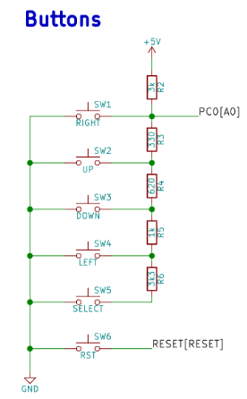
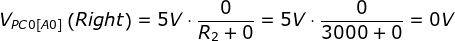
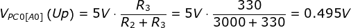
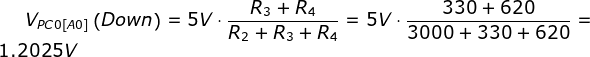
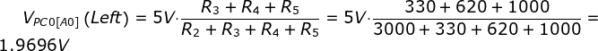
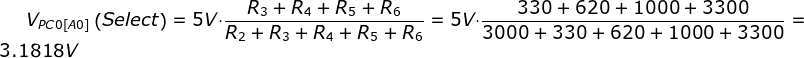
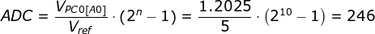
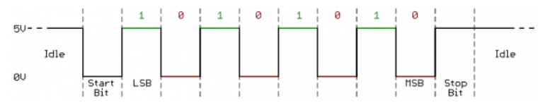
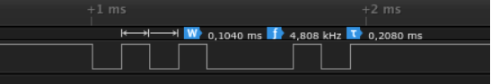
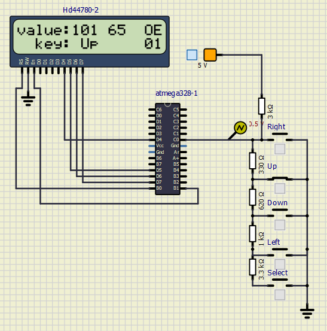

# Lab 7: ADC and UART serial communication

## Preparation before lab

´V_{PC0\left [ A0 \right ]}\left ( Right \right )=5V\cdot \frac{0}{R_{2}+0}=5V\cdot \frac{0}{3000+0}=0V´
´ADC=\frac{V_{PC0\left [ A0 \right ]}}{V_{ref}}\cdot \left ( 2^{n}-1 \right )=\frac{1.2025}{5}\cdot \left ( 2^{10}-1 \right )=246´

[Library of LCD](http://www.peterfleury.epizy.com/doxygen/avr-gcc-libraries/group__pfleury__lcd.html)

| **Push button** | **PC0[A0] voltage** | **ADC value (calculated)** | **ADC value (measured)** |
| :-: | :-: | :-: | :-: |
| Right  | 0&nbsp;V | 0   | 0 |
| Up     | 0.495&nbsp;V | 101 | 101 |
| Down   | 1.2025&nbsp;V | 246,03 | 245 |
| Left   | 1.9696&nbsp;V | 402,98 | 402 |
| Select | 3.1818&nbsp;V | 650,99 | 650 |
| none   | 5&nbsp;V | 1023 | 1022 |

| **Operation** | **Register(s)** | **Bit(s)** | **Description** |
| :-: | :-- | :-- | :-- |
| Voltage reference | ADMUX | REFS1:0 | 01: AVcc voltage reference, 5V |
| Input channel | ADMUX | MUX3:0 | 0000: ADC0, 0001: ADC1, ... |
| ADC enable | ADCSRA | ADEN | 1: Enable ADC |
| Start conversion | ADCSRA | ADSC | 1: In Single Conversion start |
| ADC interrupt enable | ADCSRA | ADIE | 1: Enable interrupt |
| ADC clock prescaler | ADCSRA | ADPS2:0 | 000: Division factor 2, 001: 2, 010: 4, ...|
| ADC result | ADCH,ADCL | ADC9:0 | Conversion result |

Modul AVR ADC má 10bitové rozlišení s přesností +/- 2LSB. To znamená, že vrací 10bitovou celočíselnou hodnotu, tj. Rozsah 0 až 1023.  
Zmínili jsme, že na pinech je k dispozici 8 kanálů ADC, ale existují také tři vnitřní kanály, které lze vybrat pomocí dekodéru multiplexeru.  
Jedná se o teplotní čidlo (kanál 8), referenční pásmo (1,1 V) a GND (0 V).

## Laboratory

[ASCII TABLE](http://www.asciitable.com/)

[Library of UART](http://www.peterfleury.epizy.com/doxygen/avr-gcc-libraries/group__pfleury__uart.html)

Množství bitů se dá měnit od 5 do 9, součástí rámce se přenáší Start a Stop bity, které slouží jako synchronizace a paritní volitelný bit. Přenáší se nejčastěji nejméně významný bit (LSB).
 Parita je jednoduchá kontrola, která se dá vytvořit rozšířením všech 5-9 datových bitů na sudé nebo liché číslo. Například za předpokladu, že parita je nastavena na sudou a byla přidána do datového bajtu 0110_1010, který má sudý počet 1 (4), by byl paritní bit nastaven na 0. Naopak, pokud by byl paritní režim nastaven na lichý, paritní bit by byl 1.

9600 8N1: 8 datových, N bez parity a Stop bit, 9600 rychlost
O: odd- lichá
E: even- sudá

Písmeno E: 0100_0101 (0x45); bitová perioda je 104 us, proto rychlost komunikace je tedy 1 / 104e-6 = 9615, tj. Přibližně 9600 Bd.

| **Function name** | **Function parameters** | **Description** | **Example** |
| :-- | :-- | :-- | :-- |
| `uart_init` | `UART_BAUD_SELECT(9600, F_CPU)` | Initialize UART to 8N1 and set baudrate to 9600&nbsp;Bd | `uart_init(UART_BAUD_SELECT(9600, F_CPU));` |
| `uart_getc` | `0;UART_NO_DATA;UART_BUFFER_OVERFLOW;UART_OVERRUN_ERROR;UART_FRAME_ERROR` | Dostávání informací o přenosu + Data | `uart_getc(void);` |
| `uart_putc` | Unsigned Char Data | Poslání char dat | `uart_putc(char data);` |
| `uart_puts` | Const. Char s | Poslání jednoho znaku | `uart_puts(char s)` |

