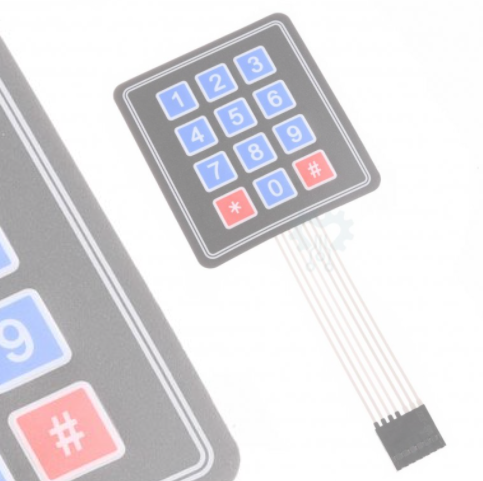
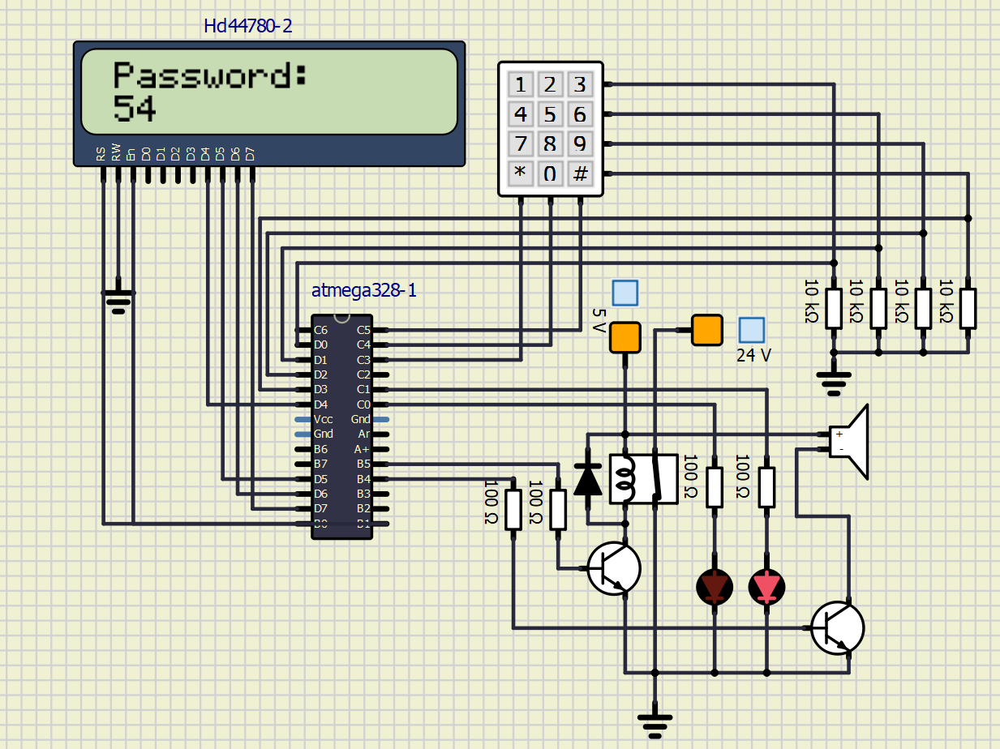
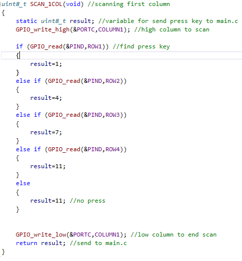
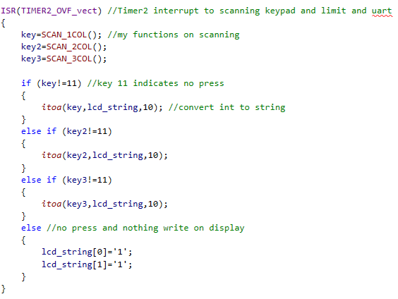
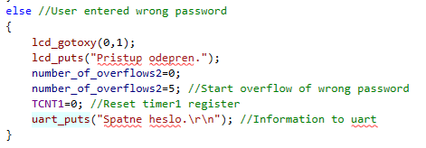
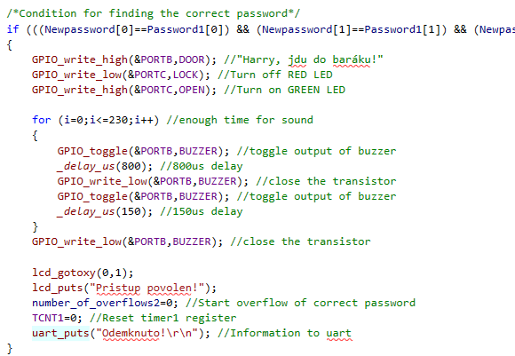
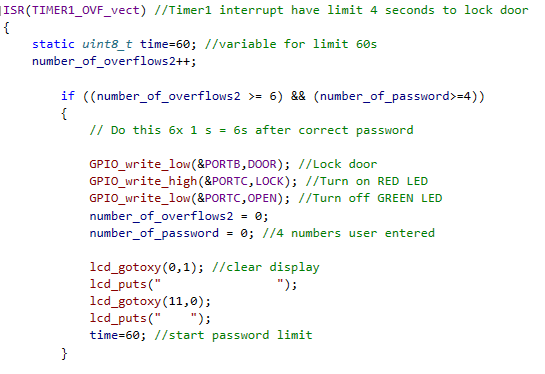
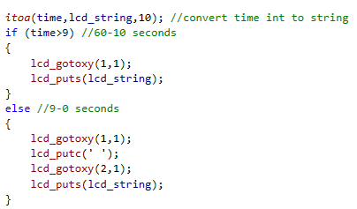
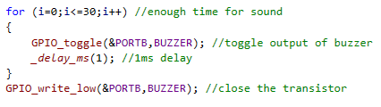
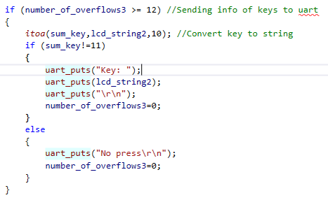

# My project: Zámek se 4x3 maticovou klávesnicí

### Team members
Petr Dočkalík: [My GitHub](https://github.com/PetrDockalik/Digital-electronics-2)

### Project objectives
Můj zadaný projekt spočívá v použití maticové klávesnice, na které uživatel má 12 tlačítek pomocí kterých zadává správné 4-místné heslo a odemyká si tak dveře. Všechny informace o tom, zda zadal správně, nebo kolik má času jsou vypisovány na LCD displej s doprovázeným zvukem.
Dále jsou posílány UARTem na Sériový monitor, kdyby zámek měl komunikovat s dalšími přídavnými obvody. Uživatel vše pozná také u signalizace dvěma LED diodami, jedna pro zamknuto a druhá pro odemknuto.  

## Hardware description

* Mikroprocesor ATmega328P
* LCD Displej HD44780 
* Maticová klávesnice 4x3 tlačítek + pull_up rezistory
* Piezo repráček
* Dvě LED diody
* Rozpínací relé

### Schéma zapojení v SimulIDE

### Vývojový diagram aplikace

## Code description

### Scan_keys.h, Scan_keys.c

Vytváření aplikace začalo knihovnou, která skenuje naši 4x3 maticovou klávesnici, tím způsobem, že dáme jeden sloupec na vysokou úroveň a zjišťujeme jaké úrovně jsou na jednotlivých řádcích. Když je na řádku vysoká úroveň také, odpovídá tomu příslušné tlačítko a informaci které, odesílám do main.c.
Zároveň jsme si vytvořili funkci, která nám inicializuje vstupní a výstupní piny naší ATmegy 328P. 

### main.c

Údaje o tlačítkách máme v přerušení Časovače/Čítače2 s přetečením 1ms. Skenování klávesnice bylo potřeba dělat rychle. Z poslaných údajů jsme si zjistili, zda jde o stisknuté tlačítko nebo nestisknuté. Stisknuté tlačítko si zaznamenáváme do 4-místného pole, které po zadání čtyř čísel porovnáváme s definovanými správnými hesly.
Stisknuté tlačítko a zda uživatel zadal správně mu vypisujeme na LCD displej. Vše řešíme v přerušení časovače/čítače0 s přetečením 16ms, ale v samotném přerušení jsme kulišácky zvedli tento čas na 100ms, jako jsme si ukazovali v předešlých laboratořích. Tyto časy jednotlivých cyklů byly zjištěny metodou pokus/omyl tak, aby to bylo pospolu co nejlépe synchronizováno, což mi příjde teď.
Když uživatel zadá špatné heslo, vypíše mu to displej a dveře zůstávají nadále zamčeny. Je tu 1 sekunda prodleva než uživatel může zadávat heslo znovu. Je to řešeno pomocí přerušení časovače/čítače1 s přetečením 1s. Samozřejmě mu smažeme předešlé informace na displeji a teď uživatel zadává např. správné heslo. Když zadá správné, než proběhne cykl v přerušení časovače1 tentokrát s prodlevou 6s, odemkneme v přerušení časovače0 ještě dveře a rozsvítíme zelenou LED diodu jako signalizaci.
Protože tyto příkazy na konci cyklu 6s zase změníme zpět. Zároveň jsme toto přerušení1 využili k vypisování 60 sekundového limitu, když jsme si tak pěkně nastavili dobu přetečení.

Využili jsme také piezo repráčku, který uživateli pomáhá zbystřit při používání aplikace a pomocí UArtu by šlo komunikovat i s dalšími obvody.

### Ostatní knihovny

Ostatní soubory .h a .c používáme z předešlých laboratoří, které není třeba měnit a jen nám usnadňují práci. Není potřeba je více rozebírat, když je známe.

## Simulations

Vytváření aplikace bylo neustále prověřováno simulacemi. Dalo by se říct, že některé problémy jsem nemohl vyřešit jinak než stylem pokus/omyl. Například bych mohl zmínit problém, když jsem zkoušel skenování klávesnice v jedné funkci. Nefungovalo to, protože sice jsme měli v jednom sloupci tlačítko stisknuto, ale při ověřování jiného sloupce se nám tato hodnota přepsala na No Press. Tudíž jsem to musel rozdělit na tři funkce a pak si ze tří "resultů" získat jedno stisknuté tlačítko.

Nebo se ocitl problém s UArt odesíláním, které mi seklo celý program. Myslel jsem, že je problém s bufferem, ale nebyl. Tento problém jsem řešil i v laboratorním úkolu. Zjistil jsem, že odesílání na UArt potřebuje být v přerušení s větším přetečením. Např. 1ms je málo.

Výsledky simulace bych chtěl nejvíce demonstrovat v natočeném videu, kde jsem nejvíce otestoval funkčnost aplikace jako ukázku simulace pro Vás.

## Video/Animation

[Ukázka na mém disku](https://drive.google.com/file/d/1IhZ9wTEXPgBNeCmaVWvhRnlV9zvXH-z9/view?usp=sharing)

## References

*Knihovny z předešlých laboratoří [1](https://github.com/PetrDockalik/Digital-electronics-2/tree/master/Labs)
*Dvojitá podmínka v IF() [2](https://www.itnetwork.cz/cecko/zaklady/cecko-tutroial-podminky-vetveni)
*Měl jsem stejný projekt ve VHDL [3](https://github.com/PetrDockalik/Digital-electronics-1/tree/master/Labs/09-Projekt)